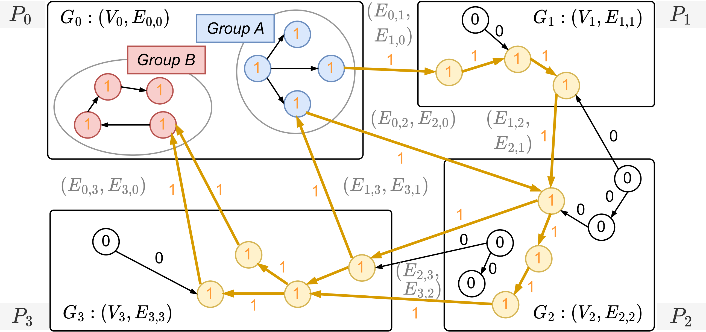
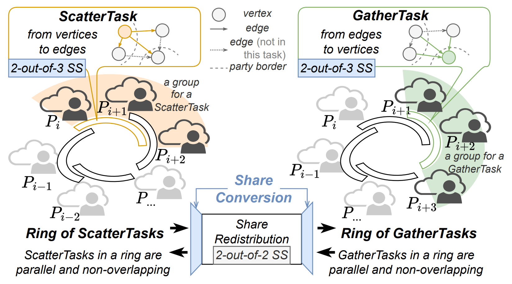

<div align="center">


<h1 >Optimal Secure Vertex-Centric Computation <br> for Collaborative Graph Processing</h1>

[](https://opensource.org/licenses/MIT)
<!-- []() -->

</div>

This repository contains a prototype implementation of the protocols proposed in *RingSG: Optimal Secure Vertex-Centric Computation for Collaborative Graph Processing (Accepted by ACM CCS 2025)*, with primary focuses on reproducing the paper's experimental results and fostering future research.

The codebase is largely built upon [aby3](https://github.com/ladnir/aby3), a widely adopted scheme for efficient privacy-preserving computation. Our code adheres to the original organization/style of the [aby3](https://github.com/ladnir/aby3) library, and uses modular protocol realizations with unit tests to help future utilization.

Here is the table of contents of this document:
- [0 Necessary Backgrounds](#0-necessary-backgrounds): some brief background information about RingSG;
- [1 Introduction](#1-introduction): introduce organization of the codebase;
- [2 Quick Set Up](#2-quick-set-up): environmental requirements and step-by-step setup instructions;
- [3 Full Evaluation](#3-full-evaluation): steps to run each part of the experiments and plot the results.  
- [4 Visualized Demo](#4-visualized-demo): NEW!!! visualized demo for helping understand the problem setting and how RingSG runs.  

> Caveat!!! Similar to the original [aby3](https://github.com/ladnir/aby3) library, this codebase should NOT be considered fully secure. It has not had a security review and there are still several security related issues that have not been fully implemented. Only use this codebase as a proof-of-concept or to benchmark the perfromance. Future work is required for this implementation to be considered secure.

## 0 Necessary Backgrounds

### 0.1 Collaborative Graph Processing

<p align="center">
  
</p>

*Collaborative graph processing* refers to the jointly analysis of the private graph data held by multiple graph owners, *without revealing each owner's raw graph data* to any other graph owners. The local graphs of different graph owners are interleaved by some *inter-edges* and finally consititute a *global graph*.

- For example, in financial scenarios, each graph owner can be a bank, with each local graph being the transfer graph inside a bank, and inter-edges corresponding to inter-bank transfers. These local transfer graphs are concatenated into a global transfer graph by inter-bank transfers.

The goal of Collaborative Graph Processing is to have the parties (graph owners) jointly run *a graph algorithm* on the global graph, thus obtaining data insights that are unavailable from a siloed graph held by a single graph owner. In the representative example above, $P_0$ wants to detect the connections between two groups of vertices (A and B). Although both groups are within $G_0$, $P_0$ cannot detect the connections on its own, because A and B are inter-connected by complex cross-graph links, rather than simple intra-edges. This is a common money laundering strategy for financial criminals to hide the source of illegal money. To detect such behaviors, all four parties need to collectively analyze the global graph. 

- The graph algorithm can be as traditional as [Connected Component Labeling](https://en.wikipedia.org/wiki/Connected-component_labeling), [Shortest Path](http://en.wikipedia.org/wiki/Shortest_path_problem) and [PageRank](http://en.wikipedia.org/wiki/PageRank), or be more Advanced like [Graph Neural Network](https://en.wikipedia.org/wiki/Graph_neural_network) training/inference.
- A straightforward example is in Anti-money laundering (AML), where we MUST aggregates graph data from multiple financial institutions to detect malicious cross-border fund flows, which ecomes infeasible when relying solely on isolated local graph data maintained by individual banks.

A primary requirement of collaborative graph processing is to protect the raw graph data privacy of each graph owner. We want the graph owners to jointly obtain a graph algorithm output without viewing/direct sharing others' raw graph data, which raises substantial privacy concerns and may violate regulatory requirements.

### 0.2 RingSG and Our Core Contributions

RingSG is a new system proposed for collaborative graph processing. It is built upon [the vertex-centric abstraction](https://dl.acm.org/doi/10.1145/1807167.1807184) (abstracted as iterations of Scatter/Gather operation centering vertices) for generally supporting various graph algorithms (like Connected Component, Shortest Path and PageRank), and cryptographic techniques (secret share and general-purpose secure multi-party computation) to enforce end-to-end provable security/privacy (under the semi-honest threat model). Distinguished from prior efforts, RingSG is featured by:

<p align="center">
  
</p>

- **Ring-ScatterGather**: A novel computation paradigm that securely decomposes secure vertex-centric computation into rings of parallel tasks, where each task handles a *subgraph* of the *global graph (consisting of all graph owners' graphs)* and is assigned to a (sub)group of parties among all the graph owners for execution. Ring-ScatterGather eliminates expensive cryptographic operations used in prior works (e.g., oblivious sort used in [GraphSC, IEEE S&P'15](https://ieeexplore.ieee.org/document/7163037) and [Graphiti, ACM CCS'24](https://dl.acm.org/doi/10.1145/3658644.3670393)), and simultaneously ensures that the MPC tasks in each ring are mutually exclusive (which means that the graph data handled by different tasks is non-overlapping, different from the overlapped tasks in [CoGNN, ACM CCS'24](https://dl.acm.org/doi/10.1145/3658644.3670300)). This finally leads to the first touch of the *optimal computation/communication complexity for secure vertex-centric computation*.
    - In particular, for each iteration of secure vertex-centric computation, the overall computation/communication overhead of all parties in RingSG is $O(|V|+|E|)$, where $|V|$ and $|E|$ represent the numbers of vertices and edges in the global graph, respectively. This is \emph{optimal} because it is linear to $(|V|+|E|)$ and independent of the number of parties $N$, making it more efficient than both state-of-the-art outsourced computation schemes ( GraphSC and Graphiti, $O((|V|+|E|)\log(|V| + |E|))$ ) and CoGNN ( $O(N|V|+|E|)$ ). See [Section 4 Ring-ScatterGather Paradigm].
- **Concrete Efficiency via Multiple Protocol-Level Optimizations**: Within the Ring-ScatterGather paradigm, RingSG introduces two key concrete-efficiency optimizations:
    - On-demand Incorporation of 3PC via Share Conversion: While the Ring-ScatterGather paradigm requires 2-out-of-2 secret share for workload decomposition and task distribution, we propose dynamic share-conversion mechanisms to allow incorporation of 3PC based on 2-out-of-3 secret share for efficient task execution. See [Section 5.1 On-demand Incorporation of 3PC].
    - Oblivious Group Aggregation (OGA) with halved rounds: We pinpoint the most cost-heavy operation in RingSG (i.e., OGA, which is used for securely aggregating edge-generated updates targeting the same vertices) and design a novel protocol that halves the communication rounds of the state-of-the-art protocol without introducing extra operational overheads. This leads to significant decrease in the system running time. See [Section 5.2 OGA with halved rounds].
- **End-to-End System Instantiation**: We present the end-to-end instantiation of RingSG in two *real-world anti-money laundering applications*, named Detect Group Connection and Trace Transfer Chain. The design of RingSG has enabled efficient and privacy-preserving extraction of application-specific results from the protocol outputs, which has never been achieved or discussed in prior state-of-the-arts. See [Section 6 End-to-end System Instantiation].

## 0.3 The Evaluations Performed in the Paper

Our experiments center around evaluating the efficiency advantages of RingSG compared to prior state-of-the-arts. Our baselines include:
- GraphSC, which refer to a series of works based on the outsourced secure computation paradigm. We utilize its state-of-the-art design proposed in Graphiti, ACM CCS 2024, and reimplemented it via aby3 for fair comparison.
- CoGNN, ACM CCS 2024, which is more similar to RingSG due the its collaborative computation nature (instead of outsourced computation). We reimplemented CoGNN by replacing its expensive 2PC with aby3-based 3PC, through our dynamic share conversion mechanisms. This baseline should fairly demonstrate the paradigm-specific advantage of RingSG compared to CoGNN, by neutralizing the efficiency difference caused by different MPC backends.

The experiments include:
- Figure 8: Running time and Per-party communication for different global graph sizes.
- Figure 9: Running time and Per-party communication for different numbers of parties.
- Figure 10: Running time and Per-party communication for different numbers of parties.
- Table 2: Per-iteration duration and per-party communication of various schemes. (This experiment contains a comparison with the original 2PC-based CoGNN implementation, which is not included in this codebase.)
- Table 3 and Table 4: Per-iteration duration breakdowns of RingSG and CoGNN to demonstrate the efficiency of our OGA protocol.
- Table 5: Running time and communication of the two end-to-end instantiations of RingSG, with a comparison to the non-end-to-end counterparts of prior state-of-the-arts.

> Note that RingSG contributes primarily to efficient secure vertex-centric computation (graph processing), so the evaluated graph algorithms do not include GNNs, whose costs are dominated by non-graph operations like weight matrix multiplication.

## 1 Introduction

The organization of this codebase and basic information on each folder/file are as below:

```bash
└── 📁aby3
    └── 📁aby3
    └── 📁aby3_tests
    └── 📁aby3-DB
        └── CMakeLists.txt
        └── OblvSwitchNet.cpp # The Oblivious Extended Permuation (OEP) Implementation
        └── OblvSwitchNet.h
        └── OblvPermutation.cpp # The Oblivious Permuation (OP) Implementation
        └── OblvPermutation.h
    └── 📁aby3-DB_tests
        └── CMakeLists.txt
        └── PermutaitonTests.cpp  # Unit tests for OEP and OP
        └── PermutaitonTests.h
    └── 📁aby3-Graph
        └── CMakeLists.txt
        └── cognn_cc.cpp # 3PC-based CoGNN Implementation
        └── cognn_cc.h 
        └── graphsc.cpp # 3PC-based GraphSC (Graphiti) Implementation
        └── graphsc.h
        └── OEP.cpp # OEP Wrapper
        └── OEP.h
        └── OGA.cpp # OGA Implementation
        └── OGA.h
        └── operators.cpp # Some basic circuits
        └── operators.h
        └── ours.cpp # RingSG Implementation
        └── ours.h
        └── shuffle.cpp # 3PC-based secret-shared shuffle (for GraphSC)
        └── shuffle.h
        └── sort.cpp # 3PC-based secure sort (for GraphSC)
        └── sort.h
        └── utils.cpp
        └── utils.h
    └── 📁aby3-Graph_tests # Unit tests for graph-related protocols
        └── CMakeLists.txt
        └── graph_tests.cpp
        └── graph_tests.h
        └── tests.cpp
        └── tests.h
    └── 📁eval # Folder of evaluation scripts
        └── 📁scripts # Scripts for setting network namespaces (for simulating the running environment of each party)
        └── 📁log # Logs of each experiment
        └── 📁plot
            └── 📁fig
            └── plot_3pc_cmp.py # Plot Table 2
            └── plot_ablation.py # Plot Table 3 & 4
            └── plot_e2e.py # Plot Table 5
            └── plot_num_parties.py # Plot Figure 9
            └── plot_scales.py # Plot Figure 8
            └── plot_vertex_degrees.py # Plot Figure 10
        └── CMakeLists.txt
        └── eval_func.cpp
        └── eval_func.h
        └── main.cpp # Entrance of evaluation executable
        └── tmp_run_cluster.py # Script for running all (or each part of) evaluations
    └── 📁frontend
    └── 📁thirdparty # Third-party dependencies
    └── .gitignore
    └── build.py # The building script
    └── CMakeLists.txt
    └── LICENSE
    └── README.md
```

## 2 Quick Set Up

We provide a build-from-source Docker image for your convenience.
- Nevertheless, you can also set up RingSG according to the original [aby3](https://github.com/ladnir/aby3) library's setup instructions, which might be non-trivial do to the dependencies setup process.

### 2.1 Environmental Requirements

We summarize the required hardware resources and software conditions for running the Docker image we provide.

**Hardware Resources**
- An x86_64 Linux server (at least 64GB RAM, 256GB spare disk)
    - We tested on Intel(R) Xeon(R) Gold 6348 CPU @ 2.60GHz with 512GB RAM

**Software Resources**
- Operating System
    - We tested on Ubuntu 20.04 (with APT package manager)
- Docker
    - We tested on Docker version 27.4.0

### 2.2 Step-by-Step Instructions

> Please don't hesitate to reach out for us if you met any problems during this process. Please kindly attach the error information. Thanks!

Pull the image (~10min, depending on your network condition):

```bash
sudo docker pull cbackyx/ringsg-ae:build-from-source-v2
```

Now start the container and build the artifacts from source (~5min):

```bash
sudo docker run -it --rm --privileged --security-opt apparmor=unconfined cbackyx/ringsg-ae:build-from-source-v2 /bin/bash
python build.py --setup
python build.py

# The expected output is:
# ...
# [ 92%] Building CXX object eval/CMakeFiles/eval-remove-oga.dir/eval_func.cpp.o
# [ 93%] Linking CXX static library libaby3-graph_Tests-remove-oep.a
# [ 93%] Built target aby3-graph_Tests-remove-oep
# [ 94%] Building CXX object eval/CMakeFiles/eval-remove-oep.dir/main.cpp.o
# [ 95%] Building CXX object eval/CMakeFiles/eval-remove-oep.dir/eval_func.cpp.o
# [ 96%] Linking CXX executable eval
# [ 96%] Built target eval
# [ 97%] Linking CXX executable eval-remove-oga
# [ 98%] Linking CXX executable eval-remove-oep
# [ 98%] Built target eval-remove-oga
# [ 98%] Built target eval-remove-oep
# [100%] Linking CXX executable frontend
# [100%] Built target frontend
```

Run a smallest efficiency test (~10 min):
- This run corresponds to a smallest-version of Figure 8 (where the global graph is of sizes ranging from $2^{12}$ ro $2^{16}$, instead of from $2^{17}$ to $2^{21}$).
- Some errors might be alerted during channel setup (handshake), but they don't harm the task completion.

```bash
cd eval
python tmp_run_cluster.py --efficiency-scales --smallest

# qdisc htb 1: dev vethH root refcnt 113 r2q 10 default 0x11 direct_packets_stat 0 direct_qlen 1000
# qdisc netem 10: dev vethH parent 1:11 limit 1000 delay 1.0ms
# qdisc noqueue 0: dev lo root refcnt 2 
# qdisc htb 1: dev vethI root refcnt 113 r2q 10 default 0x11 direct_packets_stat 0 direct_qlen 1000
# qdisc netem 10: dev vethI parent 1:11 limit 1000 delay 1.0ms
# qdisc noqueue 0: dev lo root refcnt 2 
# qdisc htb 1: dev vethJ root refcnt 113 r2q 10 default 0x11 direct_packets_stat 0 direct_qlen 1000
# qdisc netem 10: dev vethJ parent 1:11 limit 1000 delay 1.0ms
# sudo ip netns exec A taskset --cpu-list 0-2 ./.././out/build/linux/eval/eval 1 8 0 9 3 0.4 2 5
# sudo ip netns exec B taskset --cpu-list 3-5 ./.././out/build/linux/eval/eval 1 8 1 9 3 0.4 2 5
# sudo ip netns exec C taskset --cpu-list 6-8 ./.././out/build/linux/eval/eval 1 8 2 9 3 0.4 2 5
# sudo ip netns exec D taskset --cpu-list 9-11 ./.././out/build/linux/eval/eval 1 8 3 9 3 0.4 2 5
# sudo ip netns exec E taskset --cpu-list 12-14 ./.././out/build/linux/eval/eval 1 8 4 9 3 0.4 2 5
# sudo ip netns exec F taskset --cpu-list 15-17 ./.././out/build/linux/eval/eval 1 8 5 9 3 0.4 2 5
# sudo ip netns exec G taskset --cpu-list 18-20 ./.././out/build/linux/eval/eval 1 8 6 9 3 0.4 2 5
# sudo ip netns exec H taskset --cpu-list 21-23 ./.././out/build/linux/eval/eval 1 8 7 9 3 0.4 2 5
# SUCCESS
```

Each line like `sudo ip netns exec <> taskset --cpu-list <>` set up a process with corresponding network namespace, representing a party participating in RingSG's collaborative graph processing.

After this run, the corresponding logs are stored in `eval/log`, organized based on evaluation settings (like evaluated schemes, number of parties, algorithms, etc.). Fill free to browse them! For example:

```bash
cat log/efficiency-scales/log/executable_0/net_cond_4000_1/num_parts_8/scale_10/alg_0/iters_5/efficiency_0.log

# The expected console output is like:
# OGA ENABLED
# OEP ENABLED
# ::Scatter took 0.049 seconds
# ::Gather took 0.062 seconds
# ::Scatter took 0.008 seconds
# ::Gather took 0.054 seconds
# ::Scatter took 0.006 seconds
# ::Gather took 0.054 seconds
# ::Scatter took 0.005 seconds
# ::Gather took 0.054 seconds
# ::Scatter took 0.005 seconds
# ::Gather took 0.054 seconds
# pIdx::0 
# recv: 4.38295MB sent:4.38295MB total: 8.7659MB
# ::ours took 0.366 seconds
```

## 3 Full Evaluation

Now let's head for the full evaluations corresponding to the key results obtained in our paper. Fully running all the experiments in our paper might **take 3 days or more**. You can selectively verify some specific settings.

**Cautions:**
- **DO NOT** clean the log and comm folders, since they would be used for plot.
- We provide a smallest version of our experiments for our audience who want to quickly verify our results. To enable this version, simply add the `--smallest` flag to each of your evaluation and plot instruction.

The evaluation options provided by `tmp_run_cluster.py` include:
> Note that we also clarify which option (setting) corresponds to each Figure/Table in our paper.
> Estimations of running durations are provided, but it shall vary according to your hardware condition.

```bash
python tmp_run_cluster.py -h 

# usage: tmp_run_cluster.py [-h] [--efficiency-scales] [--efficiency-num-parties] [--efficiency-vertex-degrees] [--efficiency]
#                           [--efficiency-remove-oga] [--efficiency-remove-oep] [--three-pc-cmp] [--app] [--prior-non-e2e] [--smallest] [--all]

# Evaluate RingSG, CoGNN and GraphSC for various collaborative graph processing tasks.

# optional arguments:
#   -h, --help            show this help message and exit
#   --efficiency-scales   Evaluate efficiency (duration + communication) with various graphs scales  (~10h, Figure 8)
#   --efficiency-num-parties
#                         Evaluate efficiency (duration + communication) with various numbers of parties (~10h, Figure 9)
#   --efficiency-vertex-degrees
#                         Evaluate efficiency (duration + communication) with various average vertex degrees. (~10h, Figure 10)
#   --efficiency          Evaluate efficiency (duration + communication) with various network conditions, graph algs. (~10h, Table 3, Table 4)
#   --efficiency-remove-oga
#                         Evaluate efficiency (duration + communication) with various network conditions, graph algs. (Remove OGA) (~5h, Table 3, Table 4)
#   --efficiency-remove-oep
#                         Evaluate efficiency (duration + communication) with various network conditions, graph algs. (Remove OEP) (~9h, Table 3, Table 4)
#   --three-pc-cmp        Evaluate efficiency (duration + communication) for incorporating 3pc via share conversion. (~5h, Table 2)
#   --app                 Evaluate Application (~4h, Table 5)
#   --prior-non-e2e       Evaluate prior works non e2e (~5h, Table 5)
#   --smallest            Evaluate with smallest scale
#   --all                 Evaluate ALL
```

You can feel free to run ALL experiments with *smallest* scale to quickly verify the results:

```bash
python tmp_run_cluster.py --all --smallest
```

Or, run each experiment with *smallest* scale, like:

```bash
python tmp_run_cluster.py --efficiency-scales --smallest
```

You can `cat` the corresponding log files for each evaluation setting to view the current running progress.

As you have run each part of the experiments, plot the corresponding results (as PDF figures or markdown Tables):

> Note that you can should add `--smallest` flag to the plot instructions if you run the corresponding experiments with smallest scale.

```bash
cd eval/plot
python plot_scales.py # Figure 8; after you run --efficiency-scales
python plot_num_parties.py # Figure 9; after you run --efficiency-num-parties
python plot_vertex_degrees.py # Figure 10; after you run --efficiency-vertex-degrees
python plot_3pc_cmp.py # Table 2; after you run --three-pc-cmp
python plot_ablation.py # Table 3, 4; after you run --efficiency, --efficiency-remove-oga, --efficiency-remove-oep
python plot_e2e.py # Table 5; after you run --app, --prior-non-e2e
```

Copy the PDF figure from the container for local display:

```bash
# In your local (host) machine:
mkdir tmp && cd tmp
sudo docker cp <your-container-id>:/work/eval/plot/fig ./
```

## 4 Visualized Demo

We added a visualized Demo for helping the audience better understand the problem setting of RingSG and how RingSG runs. Check out the [Demo README](demo/README.md)!

Have fun!
