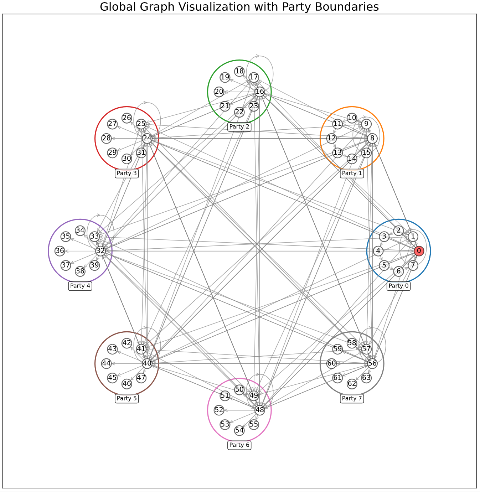
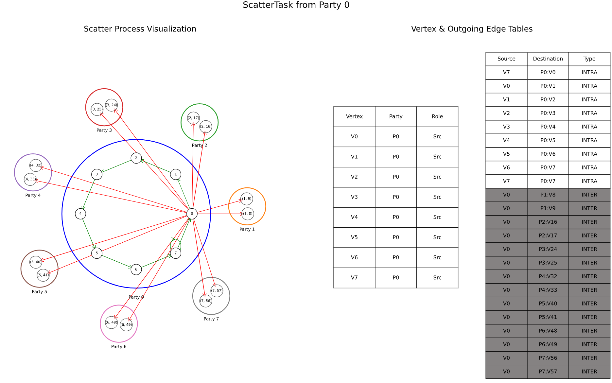
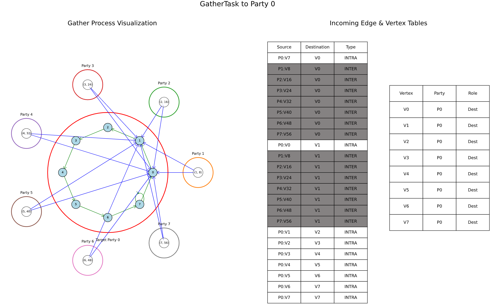
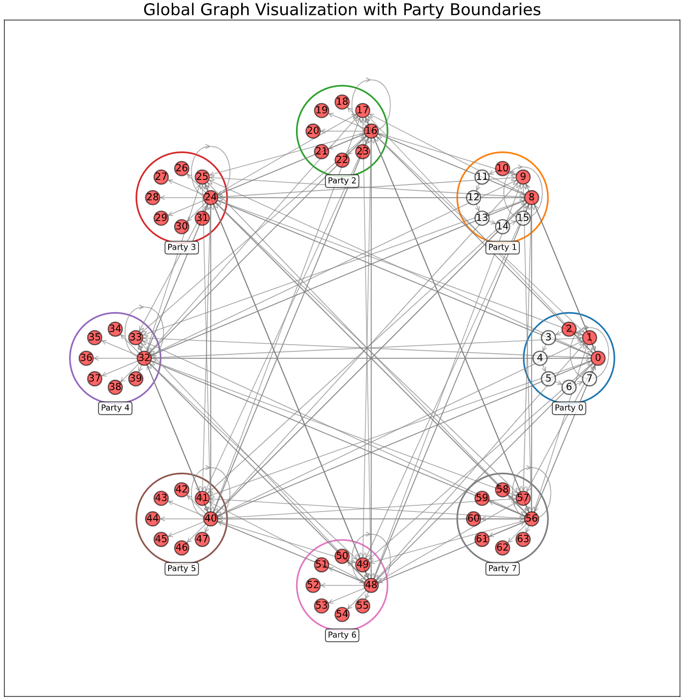

<div align="center">

<h1 >Visualized Demo for RingSG</h1>

</div>

We prepared a smallest demo based on the Connected Component Labeling algorithm for helping you understand (i) the problem setting of RingSG, and (ii) how RingSG runs.

## Step 0 Pull & Build

Pull the image with demo:

```bash
sudo docker pull cbackyx/ringsg-ae:build-from-source-demo
```

Start your container and build:

```bash
sudo docker run -it --rm --privileged --security-opt apparmor=unconfined cbackyx/ringsg-ae:build-from-source-demo /bin/bash
python build.py --setup
python build.py
```

## Step 1 Generate Multi-Party Graphs

```bash
# Inside the container
cd demo
python tmp_run_cluster.py --demo --command GenTestGraph
```

In the default demo setting, the generated graphs go to:

```bash
ls log/demo/log/executable_0/net_cond_4000_1/num_parts_8/scale_3/avgDegree_3/interRatio_0.6/alg_0/iters_2

# Expected Output:
# efficiency_0.log  efficiency_2.log  efficiency_4.log  efficiency_6.log  party_0.txt  party_2.txt  party_4.txt  party_6.txt
# efficiency_1.log  efficiency_3.log  efficiency_5.log  efficiency_7.log  party_1.txt  party_3.txt  party_5.txt  party_7.txt
```

Let's call this folder the **WORKSPACE_DIR**. Inside the WORKSPACE_DIR, each party's graph is stored in a separate file `party_*.txt`, recording its vertices, incoming edges and outgoing edges. For example:

```bash
cat log/demo/log/executable_0/net_cond_4000_1/num_parts_8/scale_3/avgDegree_3/interRatio_0.6/alg_0/iters_2/party_0.txt

# Expected Output:
# # Vertices (Format: VertexID VertexData)
# 0 1
# 1 0
# ...

# # Incoming Edges (Format: SourceVertexID TargetVertexID)
# # From Party 0
# 0 0
# 0 1
# 0 2
# ...

# # Outgoing Edges (Format: SourceVertexID TargetVertexID)
# # To Party 0
# 0 0
# 0 1
# 0 2
# 0 3
# 0 4
# 0 5
# 0 6
# 0 7
# 1 0
# # To Party 1
# 0 8
# 0 9
# # To Party 2
# 0 16
# ...
```

Fill free to edit vertex data and edges inside each file after changing the permission setting:
- For simplicity of this demo, we set fixed numbers of vertices/inter-edges/intra-edges. So please make sure that the numbers stay unchanged.
- Make sure that you simultaneously editing incoming edges and the corresponding outgoing edges to keep them consistent.

For example, we made the following changes to `party_0.txt` and `party_1.txt`:

```bash
sudo chmod -R 777 log/demo/log/executable_0/net_cond_4000_1/num_parts_8/scale_3/avgDegree_3/interRatio_0.6/alg_0/iters_2

vi log/demo/log/executable_0/net_cond_4000_1/num_parts_8/scale_3/avgDegree_3/interRatio_0.6/alg_0/iters_2/party_0.txt
# # Incoming Edges (Format: SourceVertexID TargetVertexID)
# # From Party 0
# 0 1
# 1 2
# 2 3
# 3 4
# 4 5
# 5 6
# 6 7
# 7 7
# 7 0

# # Outgoing Edges (Format: SourceVertexID TargetVertexID)
# # To Party 0
# 0 1
# 1 2
# 2 3
# 3 4
# 4 5
# 5 6
# 6 7
# 7 7
# 7 0

vi log/demo/log/executable_0/net_cond_4000_1/num_parts_8/scale_3/avgDegree_3/interRatio_0.6/alg_0/iters_2/party_1.txt
# # Incoming Edges (Format: SourceVertexID TargetVertexID)
# # From Party 0
# 0 8
# 0 9
# # From Party 1
# 8 9
# 9 10
# 10 11
# 11 12
# 12 13
# 13 14
# 14 15
# 15 15
# 15 8

# # Outgoing Edges (Format: SourceVertexID TargetVertexID)
# # To Party 0
# 8 0
# 8 1
# # To Party 1
# 8 9
# 9 10
# 10 11
# 11 12
# 12 13
# 13 14
# 14 15
# 15 15
# 15 8
```

Now, visualize the global graph (consisting of all parties' graphs and inter-edges):

```bash
python -m pip install networkx # DON'T forget this!
python visualize.py --input

# Expected Output
# Visualization saved to log/demo/log/executable_0/net_cond_4000_1/num_parts_8/scale_3/avgDegree_3/interRatio_0.6/alg_0/iters_2/initial_graph_visualization.pdf
```

Check out the generated pdf! The red nodes represent vertices who have the initial label **1**, while the others have the label **0**.

<p align="center">
  
</p>

## Step 2 Run RingSG

```bash
python tmp_run_cluster.py --demo --command Test

# Expected Output:
# ...
# sudo ip netns exec B taskset --cpu-list 3-5 ./.././out/build/linux/demo/demo 0 8 1 3 3 0.6 0 2 /home/zzh/project/MPC/aby3/demo/log/demo/log/executable_0/net_cond_4000_1/num_parts_8/scale_3/avgDegree_3/interRatio_0.6/alg_0/iters_2 Test
# sudo ip netns exec C taskset --cpu-list 6-8 ./.././out/build/linux/demo/demo 0 8 2 3 3 0.6 0 2 /home/zzh/project/MPC/aby3/demo/log/demo/log/executable_0/net_cond_4000_1/num_parts_8/scale_3/avgDegree_3/interRatio_0.6/alg_0/iters_2 Test
# sudo ip netns exec D taskset --cpu-list 9-11 ./.././out/build/linux/demo/demo 0 8 3 3 3 0.6 0 2 /home/zzh/project/MPC/aby3/demo/log/demo/log/executable_0/net_cond_4000_1/num_parts_8/scale_3/avgDegree_3/interRatio_0.6/alg_0/iters_2 Test
# sudo ip netns exec E taskset --cpu-list 12-14 ./.././out/build/linux/demo/demo 0 8 4 3 3 0.6 0 2 /home/zzh/project/MPC/aby3/demo/log/demo/log/executable_0/net_cond_4000_1/num_parts_8/scale_3/avgDegree_3/interRatio_0.6/alg_0/iters_2 Test
# sudo ip netns exec F taskset --cpu-list 15-17 ./.././out/build/linux/demo/demo 0 8 5 3 3 0.6 0 2 /home/zzh/project/MPC/aby3/demo/log/demo/log/executable_0/net_cond_4000_1/num_parts_8/scale_3/avgDegree_3/interRatio_0.6/alg_0/iters_2 Test
# sudo ip netns exec G taskset --cpu-list 18-20 ./.././out/build/linux/demo/demo 0 8 6 3 3 0.6 0 2 /home/zzh/project/MPC/aby3/demo/log/demo/log/executable_0/net_cond_4000_1/num_parts_8/scale_3/avgDegree_3/interRatio_0.6/alg_0/iters_2 Test
# sudo ip netns exec H taskset --cpu-list 21-23 ./.././out/build/linux/demo/demo 0 8 7 3 3 0.6 0 2 /home/zzh/project/MPC/aby3/demo/log/demo/log/executable_0/net_cond_4000_1/num_parts_8/scale_3/avgDegree_3/interRatio_0.6/alg_0/iters_2 Test
# SUCCESS
```

Now, visualize the corresponding ScatterTask and the GatherTask for each party:

```bash
python visualize.py --compute

# Expected Output
# Number of parties: 8
# Scatter visualization saved to log/demo/log/executable_0/net_cond_4000_1/num_parts_8/scale_3/avgDegree_3/interRatio_0.6/alg_0/iters_2/scatter_visualization_0.pdf
# Gather visualization saved to log/demo/log/executable_0/net_cond_4000_1/num_parts_8/scale_3/avgDegree_3/interRatio_0.6/alg_0/iters_2/gather_visualization_0.pdf
# Scatter visualization saved to log/demo/log/executable_0/net_cond_4000_1/num_parts_8/scale_3/avgDegree_3/interRatio_0.6/alg_0/iters_2/scatter_visualization_1.pdf
# Gather visualization saved to log/demo/log/executable_0/net_cond_4000_1/num_parts_8/scale_3/avgDegree_3/interRatio_0.6/alg_0/iters_2/gather_visualization_1.pdf
# Scatter visualization saved to log/demo/log/executable_0/net_cond_4000_1/num_parts_8/scale_3/avgDegree_3/interRatio_0.6/alg_0/iters_2/scatter_visualization_2.pdf
# Gather visualization saved to log/demo/log/executable_0/net_cond_4000_1/num_parts_8/scale_3/avgDegree_3/interRatio_0.6/alg_0/iters_2/gather_visualization_2.pdf
# Scatter visualization saved to log/demo/log/executable_0/net_cond_4000_1/num_parts_8/scale_3/avgDegree_3/interRatio_0.6/alg_0/iters_2/scatter_visualization_3.pdf
# Gather visualization saved to log/demo/log/executable_0/net_cond_4000_1/num_parts_8/scale_3/avgDegree_3/interRatio_0.6/alg_0/iters_2/gather_visualization_3.pdf
# Scatter visualization saved to log/demo/log/executable_0/net_cond_4000_1/num_parts_8/scale_3/avgDegree_3/interRatio_0.6/alg_0/iters_2/scatter_visualization_4.pdf
# Gather visualization saved to log/demo/log/executable_0/net_cond_4000_1/num_parts_8/scale_3/avgDegree_3/interRatio_0.6/alg_0/iters_2/gather_visualization_4.pdf
# Scatter visualization saved to log/demo/log/executable_0/net_cond_4000_1/num_parts_8/scale_3/avgDegree_3/interRatio_0.6/alg_0/iters_2/scatter_visualization_5.pdf
# Gather visualization saved to log/demo/log/executable_0/net_cond_4000_1/num_parts_8/scale_3/avgDegree_3/interRatio_0.6/alg_0/iters_2/gather_visualization_5.pdf
# Scatter visualization saved to log/demo/log/executable_0/net_cond_4000_1/num_parts_8/scale_3/avgDegree_3/interRatio_0.6/alg_0/iters_2/scatter_visualization_6.pdf
# Gather visualization saved to log/demo/log/executable_0/net_cond_4000_1/num_parts_8/scale_3/avgDegree_3/interRatio_0.6/alg_0/iters_2/gather_visualization_6.pdf
# Scatter visualization saved to log/demo/log/executable_0/net_cond_4000_1/num_parts_8/scale_3/avgDegree_3/interRatio_0.6/alg_0/iters_2/scatter_visualization_7.pdf
# Gather visualization saved to log/demo/log/executable_0/net_cond_4000_1/num_parts_8/scale_3/avgDegree_3/interRatio_0.6/alg_0/iters_2/gather_visualization_7.pdf
```

Check out the generated pdf! For example `scatter_visualization_0.pdf` and `gather_visualization_0.pdf`

<p align="center">
  
</p>

<p align="center">
  
</p>

## Step 3 Visualize the updated global graph

```bash
python visualize.py --output

# Expected Output
# Visualization saved to log/demo/log/executable_0/net_cond_4000_1/num_parts_8/scale_3/avgDegree_3/interRatio_0.6/alg_0/iters_2/updated_graph_visualization.pdf
```

Again, check out the generated pdf! The red nodes represent vertices who get the label **1**.

<p align="center">
  
</p>

## Tips

Copy the PDF figure from the container for local display:

```bash
# In your local (host) machine:
mkdir tmp && cd tmp
sudo docker cp <your-container-id>:/work/demo/log/demo/log/executable_0/net_cond_4000_1/num_parts_8/scale_3/avgDegree_3/interRatio_0.6/alg_0/iters_2 ./
```


